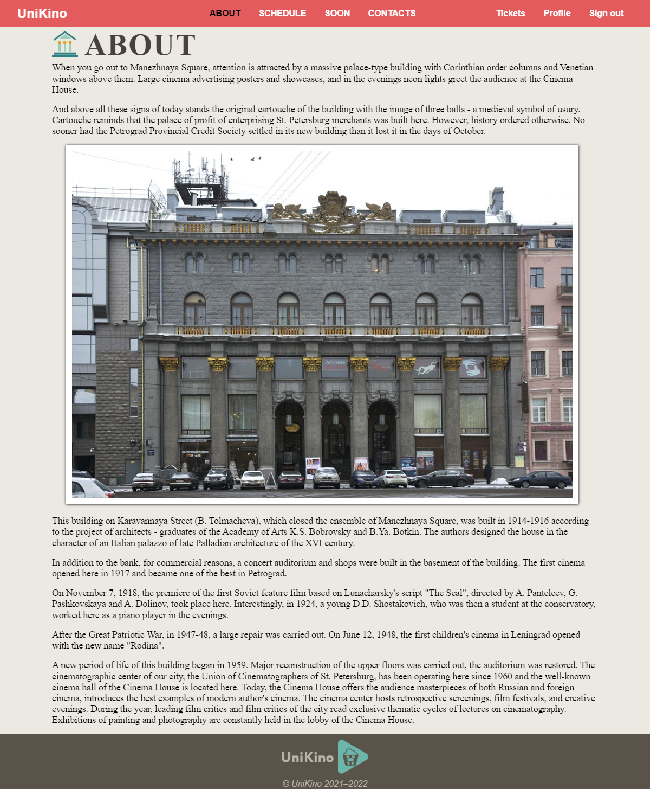
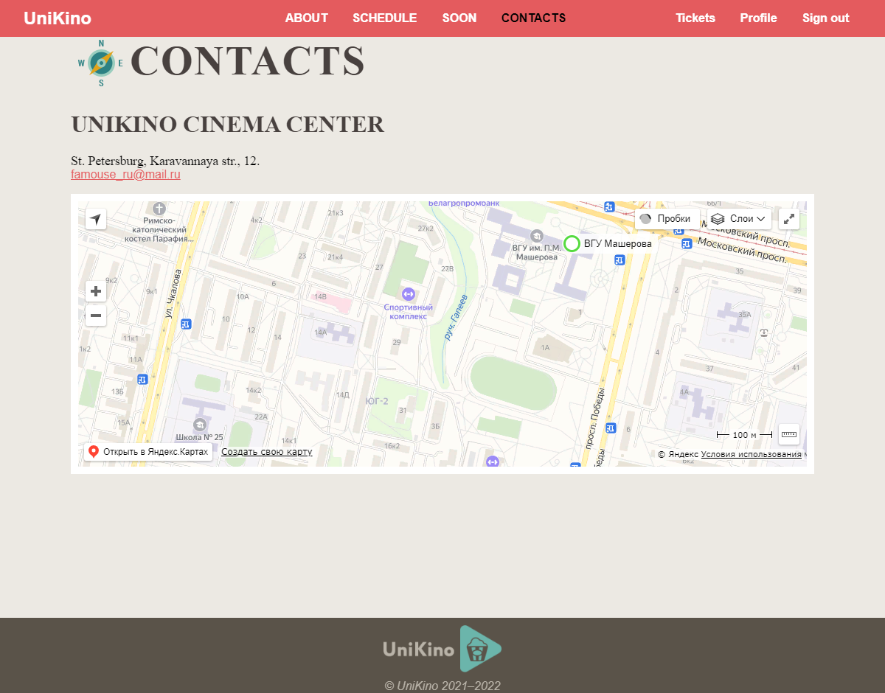
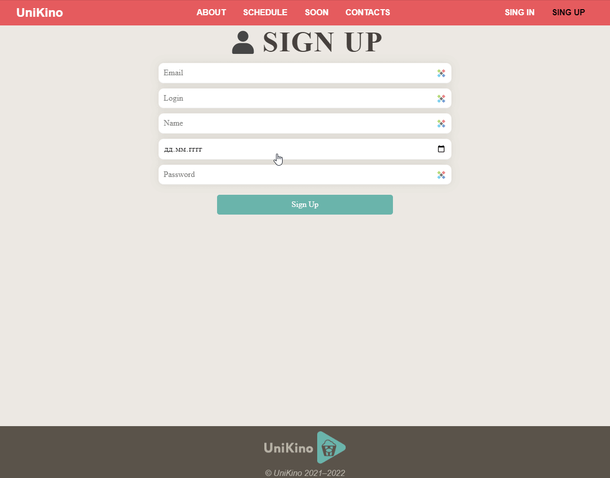
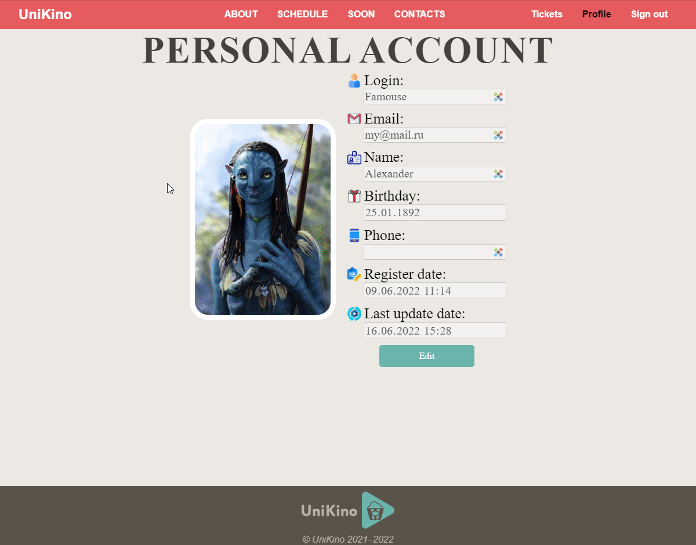

# Cinema-Angular
[Student Work] A web application with pre-written [html code](https://github.com/qFamouse/Cinema-Frontend) and a [server part](https://github.com/qFamouse/Cinema-Backend) for the cinema. 

## Preview

  
About

  

  
Schedule

  

  
Soon

  

  
Contacts

  

  
Auntefication

  

  
Profile

  

  
Mobile version

  

